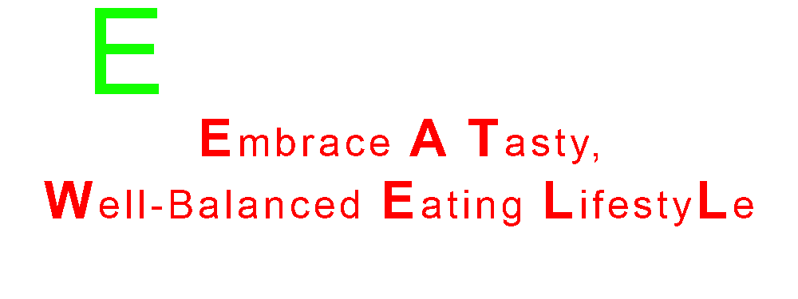

<h1 align="center">
 
 
  <i>A Nutritional Guide Software </i></h1>

### 📄 Introduction 
  This is a project proposal for CS121 - Advanced Computer Programming, which is being developed by THE AVENGERS from CS-1202. The purpose of this project is to create a personalized nutrition and meal planning software that provides users with customized nutrition plans and meal recommendations based on their individual health goals and dietary preferences. The goal of the software is to help users make healthier food choices and improve their overall health and well-being. In this proposal, we will provide an overview of the project, including its objectives, scope, and keyfeatures.
##
### 🔗 Objectives
The objectives of this project are:  
🔴 To suggest recipes based on dietary preferences and provide nutritional information for each recipe.  
🟡 To track calorie intake and help users set daily calorie goals based on weight loss or weight management goals.  
🟢 To assist users in planning their meals for the week and creating a grocery list based on chosen recipes.  
🔵 To track water intake and remind users to drink water throughout the day.  
🟣 To provide users with a food diary to track meals and progress towards health goals, including setting reminders for meal logging and progress monitoring.
##
### 🔎 Scope  
The scope of this project includes:  
📌 Sustainable Development Goal 3 is one of the 17 Sustainable Development Goals established by the United Nations in 2015. The official wording is: <i> "To ensure healthy lives and promote well-being for all at all ages." </i> The Sustainable Development Goal (SDG) that is addressed by creating a personalized nutrition and meal planning software is <b> SDG 3: Good Health and Well-being </b>. The personalized nutrition and meal planning software can help individuals make healthier food choices and improve their overall health and well-being. Additionally, the software can be used by healthcare professionals to create customized nutrition plans for their clients and patients, thereby promoting good health and well-being.  

##
### 🔑 Key Features
<h4>The following are the key features of the project:<h4>

  
<h4> 💡 recipe suggestion and nutritional information </h4>

  ◻ The software can suggest recipes based on the user's dietary preferences and provide nutritional information for each recipe.

  
<h4>📈 calorie tracking and goal setting </h4>

  ◻ The software can track the user's calorie intake and help them set daily calorie goals based on their weight loss or weight management goals.

  
<h4>📠meal planning and grocery list creation </h4>

  ◻ The software can help users plan their meals for the week and create a grocery list based on the recipes they choose.

  
<h4> 💧 water intake tracking </h4>

  ◻ The software can track the user's water intake and remind them to drink water throughout the day.

  
<h4>📖 food diary and progress tracking </h4>

  ◻ The software can provide users with a food diary to track their meals and progress towards their health goals. Users can also set reminders to log their meals and monitor their progress.

##
### 👥 Team
The following individuals will be working on this project:  
🐔 BARICAN, John Andrei A.  
🐻 GENIL, Gemma Rose L.  
🐷 GUINOBAN, Glenn M.  
:shipit: LALONGISIP, Darlyne Grace M.
##
### 💬 Conclusion
  We believe that PROJECT “EATWELL” will be a great help to improve nutritional intake, enhanced weight management, simplified meal planning, increased awareness of dietary habits,  greater adherence to dietary goals, improved health outcomes and enhanced user experience. 
##
<h3 align="center">
It is a pleasure to have the opportunity to share our project ideas with you. We are hopeful that our proposal will meet your expectations, and we thank you for considering it.
    
 
</h3>
